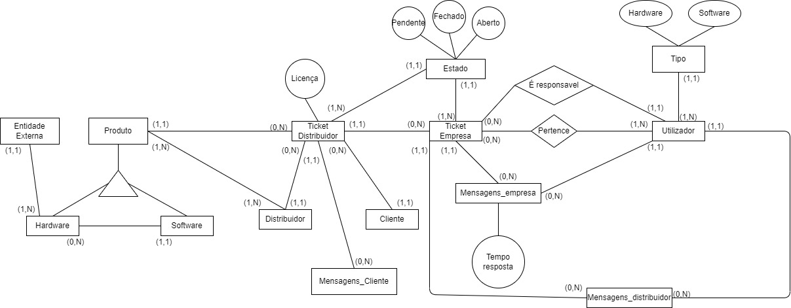

# trabalhoADD_6160_9710 - LESI - IPCA
Projeto desenvolvido para a disciplina de Armazenamento e Acesso a Dados.

Esta disciplina faz parte do segundo ano curricular da Licenciatura em Engenharia de Sistemas Informáticos.

## Colaboradores
Este trabalho contou com a colaboração dos seguintes alunos:
- 6160 - Renato Dantas
- 9710 - Fábio Mota

## Contextualização do Trabalho
Com a execução deste trabalho, pretende-se a consolidação dos conhecimentos em PostgreSQL, adquiridos durante as aulas.

Pretende desenvolver-se uma aplicação de gestão de pedidos de suporte que responda a um conjunto de necessidades da empresa.

### Tópicos a explorar durante a execução do trabalho
- Instalação e configuração do PostgreSQL numa máquina virtual Ubuntu;
- Autorização e autenticação de utilizadores;
- Operações SQL necessárias a execução do trabalho;

## 1ª Fase - Diagrama Entidade-Relação
Para a execução da primeira fase do trabalho foi necessário elaborar o diagrama de entidade-relação do problema apresentado.

## 2ª Fase - SQL
Foram elaborados os scripts de SQL com a seguintes funcinalidades:
- Criação de Schemas;
- Criação de Relations, Constraints, Indexes;
- Criação de Functions e Triggers;
- Criação de um Dataset com dados para inserir na base de dados;
- Criação de Querys;